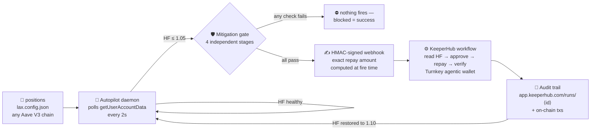
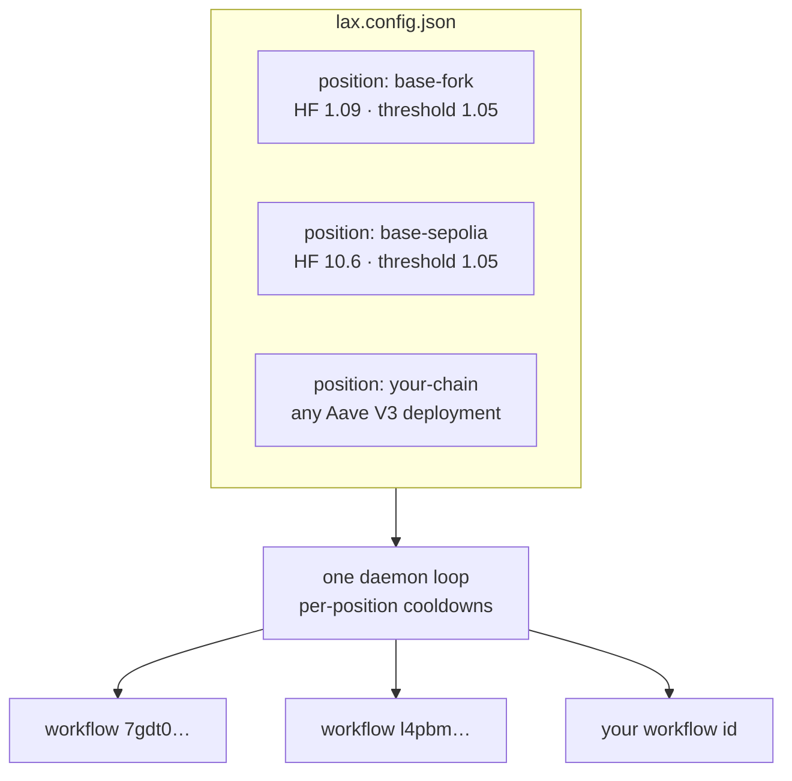

<div align="center">

```
  ▐ ▗ ▌        L   A   X
  ▜▛▘▐ ▟▛▌▛▀▘  Liquidation Autopilot — eXtended
  ▝▌ ▐ ▜▙▌▙▄▖  your position's guardian, always awake
```

**A proactive Aave V3 liquidation defender, built on [KeeperHub](https://app.keeperhub.com).**

MEV bots with Flashblocks can liquidate a position *in the same block* as the
oracle update — no reactive agent can outrun them. LAX doesn't race. It watches
your health factor continuously and repairs the position **before** the bots
ever see an opportunity.

[](docs/VERIFIED-TESTING.md)
[]()
[](LICENSE)
[](package.json)
[](https://app.aave.com)

*KeeperHub — The Agent Economy (DoraHacks) · Main track: Best Integration into a Live Project · Solo build*

</div>

---

## How it defends you



The key idea, on a health-factor timeline:

```
 HF 2.00 ───────────╮
                    ╲ price drops
 HF 1.05 ───────────●── LAX ACTS HERE ── repay debt ×(1 − HF/1.10) ──╮
                                                                    │
 HF 1.00 ───────────┊────────────────────────────────────────────●───┴── HF 1.10 · SAFE
                    ┊                                            ┊
                    MEV bots liquidate here                      bots never got a chance
```

The exact repay amount is **closed-form math** (`tests/repay-math.test.ts`, 35 cases) —
not an LLM guess. The agent decides *when*; KeeperHub executes *deterministically*.

## Quick start

```bash
git clone <repo-url> && cd LAX && npm install
npm run setup        # checks prereqs, writes .env, guides KeeperHub auth
npm run demo         # forks Base mainnet, seeds a vulnerable position, funds the wallet
npm run lax          # open the Liquidation CLI
```

In the CLI, `watch` shows the live gauge, `arm` enables the autopilot, and the
daemon defends every configured position:

```bash
npm run lax -- status                  # HF gauge + guardian state
npm run lax -- arm                     # arm the autopilot (persisted)
npm run lax -- autopilot daemon        # continuous defense
npm run lax -- autopilot daemon --dry-run   # full pipeline, never fires
```

**One command brings the whole demo up** (idempotent, self-healing):

```bash
./scripts/demo-up.sh
```

## What got built

| Surface | What it does |
|---------|--------------|
| **Liquidation CLI** | Zero-dependency terminal binary: REPL, one-shot commands, piped scripting. HF gauge, semantic-colored output, confirmation-gated actions — [full manual](docs/CLI-GUIDE.md) |
| **Autopilot daemon** | Multi-position, multi-network monitor loop with per-position thresholds, cooldowns, and hysteresis |
| **Mitigation gate** | Nothing fires without passing HF-math verification → preflight `eth_call` simulation → safety bounds → spend caps |
| **Web terminal** | The browser dashboard shares the *same command core* — embedded terminal, monitoring and audit views |
| **AI agent** | `lax-guardian` (OpenCode + NVIDIA NIM) decides when to act; [system prompt + skills + runbook](agent/) |
| **Evidence** | Every claim logged in [docs/VERIFIED-TESTING.md](docs/VERIFIED-TESTING.md) |

## Proven on-chain — Base Sepolia

The fork demo is deterministic; the **live path** moves real value on Base Sepolia
(chain 84532) through a webhook-triggered KeeperHub workflow:

```bash
./scripts/fire-sepolia.sh     # one real fire, prints audit trail + tx links
```

Verified run (2026-09-06):

| Artifact | Link |
|---|---|
| Audit trail | https://app.keeperhub.com/runs/9bc31ofdfca1m62b2v29t |
| Repay tx (debt 0.7002 → 0.4002 USDC) | https://sepolia.basescan.org/tx/0x918441fcd4d2071733afc139ed0b5c29cba34ddeefc2ca1583499b10827c8bac |
| Approve tx | https://sepolia.basescan.org/tx/0xd15cc2c844ea4a0dd50e0878d6819dcff116f48e98f7e2489e6d96679fca2e88 |

## Any chain, any wallet



- **Networks**: `lax.config.json` declares named networks (RPC + Aave Pool + USDC +
  workflow ID); each position lives on one — the daemon defends them all in a
  single loop. See [`lax.config.example.json`](lax.config.example.json).
- **Wallets**: the executing wallet resolves `LAX_WALLET_ADDRESS` →
  `~/.keeperhub/wallet.json` → config — never hardcoded. By default the wallet
  defends its own position (`LAX_SELF_DEFENSE=true`) or any address via
  `LAX_BORROWER_ADDRESS`.
- **Gas**: org-level credits (free on testnet); wallet-pays fallback covers the
  fork demo. Confirmed no event tag (Discord, Sep 10).

## The agent

LAX is an **AI agent** that decides *when* to act — execution stays deterministic:

- [`agent/SYSTEM_PROMPT.md`](agent/SYSTEM_PROMPT.md) — the guardian's standing orders and hard constraints
- [`agent/skills/`](agent/skills/) — runnable procedures: monitor HF, trigger mitigation, fund position
- [`agent/RUNBOOK.md`](agent/RUNBOOK.md) — the live demo sequence

Wired into [`opencode.jsonc`](opencode.jsonc) as the `lax-guardian` agent.

## Why this is safe by default

| Layer | Guarantee |
|-------|-----------|
| Confirmation | Destructive commands require `--confirm` or an interactive yes |
| Mitigation gate | 4 independent stages; a blocked fire is a *successful* safety outcome |
| Spend caps | Per-tx ($10) and daily ($5) caps, persisted across restarts (`~/.lax/safety.json`) |
| Arm gating | The daemon only auto-fires when the guardian is armed (`lax arm`) |
| Preflight | The approve+repay pair is simulated via `eth_call` before any real fire |

## Repository map

| Path | What lives there |
|------|------------------|
| `bin/lax.ts` | The `lax` binary entrypoint (REPL, one-shot, piped scripting) |
| `src/cli/` | The command core — parser, registry, executor, UI rendering (shared with the dashboard) |
| `src/autopilot/` | The daemon: multi-position monitor loop, mitigation gate, persisted state |
| `src/keeperhub.ts` | Webhook firing + HMAC signing + run permalinks |
| `src/config.ts` | Every address, threshold, and cap in one file |
| `dashboard/` | Web terminal — same command core in the browser, monitoring + audit views |
| `agent/` | The AI layer: `lax-guardian` system prompt, skills, demo runbook (OpenCode + NVIDIA NIM) |
| `scripts/` | Demo lifecycle: `setup.sh`, `demo-up.sh`, `fire-sepolia.sh`, fork start/stop/seed |
| `bootstrap/` | Minimal starter template (fork demo only) for teams building their own guardian |
| `contracts/MockOracle.sol` | Fork-demo scaffolding to shock the price oracle (never deployed live) |
| `api/` | Edge proxy example so the browser never holds your API key (HMAC-verified) |
| `docs/` | Curated docs — start at [`docs/README.md`](docs/README.md) |
| `tests/` | Vitest suite (13 files) — repay math, gate stages, preflight, safety, config; `bootstrap/tests/` adds a 14th for the starter template |

## Documentation

| Doc | What it is |
|-----|------------|
| [`docs/SETUP.md`](docs/SETUP.md) | Full setup from clone to running demo |
| [`docs/CLI-GUIDE.md`](docs/CLI-GUIDE.md) | Complete CLI user manual — every command, flag, and mode |
| [`docs/architecture.md`](docs/architecture.md) | System architecture: daemon, gate, webhook path, dashboard |
| [`docs/VERIFIED-TESTING.md`](docs/VERIFIED-TESTING.md) | Evidence log: what was really tested and what worked |
| [`docs/SCOPE.md`](docs/SCOPE.md) | What's in and out of scope (and why) |

## Verified, not claimed

Everything above was executed and verified — see
[`docs/VERIFIED-TESTING.md`](docs/VERIFIED-TESTING.md) for the full log: the
live-fire evidence, the gate's real blocking outcomes, the CLI command battery,
daemon modes, and the nine real bugs the verification found and fixed.

```bash
npm test          # 465 passed · 2 fork-live skipped without a fork (467 total)
npm run lint      # tsc --noEmit — clean (root + dashboard)
```

## Judging criteria trace

| Criterion | How LAX hits it |
|-----------|-----------------|
| Integration depth | Aave V3 is the named live project — integration targets the actual Pool contract (`repay()`, `getUserAccountData`), not a generic wrapper |
| Execution through KeeperHub | Real value movement: USDC approve → Aave debt repayment through the KeeperHub workflow, verifiable via tx hash + `app.keeperhub.com/runs/<id>` |
| Reliability and observability | 465-test suite, preflight dry-run simulation, safety plugin (block/daily caps, selector allowlist), KeeperHub execution polling, offline position cache |
| Usefulness and originality | Proactive-not-reactive liquidation defense at HF=1.05 — retail Aave users have no autonomous defender above the MEV-bot threshold |
| Developer experience and code quality | `npm run setup` one-command bootstrap, `bootstrap/` starter template, zero `any` types, every address in one `src/config.ts`, candid limitations documented |

## Architecture decision records

The 25 decisions behind this design — agent stack, wallet custody, the HF 1.05
proactive trigger, chain strategy, gas-sponsorship fallback — are documented in
[`docs/archive/adr/`](docs/archive/adr/). Highlights:

- ADR-001: Agent stack (OpenCode + NVIDIA NIM + custom safety plugin)
- ADR-003: Agentic wallet (first-party `@keeperhub/wallet`, Turnkey custody)
- ADR-005: Aave V3 onchain path (proactive defense at HF=1.05, two-step approve → repay, closed-form math)
- ADR-006: Gas sponsorship (org-level credits, testnet uncharged; wallet-pays-gas fork fallback)
- ADR-011: Preflight simulation (eth_call the approve+repay before any real fire)

## Bounty track — Best KeeperHub Feature (separate BUIDL)

Shipped a PR to `github.com/keeperhub/keeperhub` from the
[`docs/FEEDBACK.md`](docs/FEEDBACK.md) findings — all mergeable-scoped, tested
workarounds:

| Candidate | Feedback ref | Scope |
|-----------|-------------|-------|
| `tokenConfig` accepts raw JSON objects | C1 | API schema fix, transparent `JSON.stringify` server-side |
| Document / default `onBehalfOf` in Aave V3 repay | C2 | Docs + optional param defaulting to executing wallet |
| `autoApprove` option on Supply/RepayDebt actions | L3 | Collapses 2-node workflows to 1 |
| Gas sponsorship error code reference | M3 | Docs for `GAS_SPONSORSHIP_*` variants |

→ **PR [#2268](https://github.com/keeperhub/keeperhub/pull/2268) — merged** (gas-sponsorship fallback + `insufficient_balance` documentation).

## License

[MIT](LICENSE) © 2026 Ntokozo Dlamini
