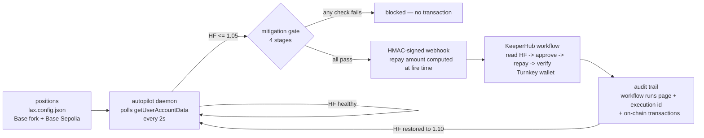
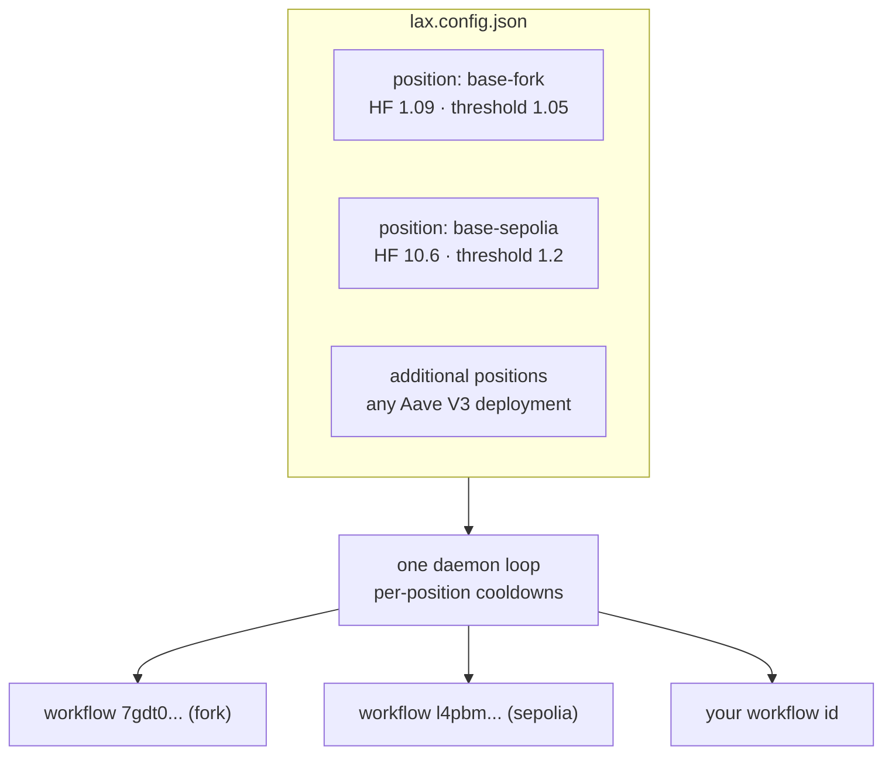

<div align="center">

# LAX — Liquidation Autopilot eXtended

Proactive Aave V3 liquidation defense built on [KeeperHub](https://app.keeperhub.com). LAX monitors health factor and restores collateralization before liquidation becomes profitable.

Aave V3 positions become liquidatable when health factor drops below 1.0. Oracle updates can make a position liquidatable within a single block. LAX polls `getUserAccountData` continuously and, when health factor falls to the configured threshold, executes a KeeperHub workflow to repay debt deterministically.

[](docs/VERIFIED-TESTING.md)
[](https://www.typescriptlang.org/)
[](LICENSE)
[](https://nodejs.org/)
[](https://app.aave.com)

DoraHacks — KeeperHub: The Agent Economy · Track: Best Integration into a Live Project · Solo build

</div>

---

## How it works



Health-factor timeline:

```
 HF 2.00 ───────────╮
                    ╲ price drops
 HF 1.05 ───────────●── LAX triggers ── repay = debt * (1 - HF/1.10) ──╮
                                                                     │
 HF 1.00 ───────────┊────────────────────────────────────────────●───┴── HF 1.10 restored
                    ┊                                            ┊
                    liquidation threshold                        safe
```

The repay amount is closed-form arithmetic (see `tests/repay-math.test.ts`, 35 cases). The agent decides when to act; KeeperHub executes deterministically.

## Quick start

```bash
git clone https://github.com/n-dlms/LAX.git && cd LAX && npm install
npm run setup        # checks prerequisites, creates .env, guides KeeperHub authentication
npm run demo         # forks Base mainnet, seeds a vulnerable position, funds the wallet
npm run lax          # open the Liquidation CLI
```

CLI examples:

```bash
npm run lax -- status                        # health factor and guardian state
npm run lax -- watch                         # live gauge with trend
npm run lax -- whatif --shock 25             # impact of a 25% collateral drop
npm run lax -- demo                          # guided tour: shock, gate, repair
npm run lax -- arm                           # arm the autopilot
npm run lax -- autopilot daemon              # continuous defense
npm run lax -- autopilot daemon --dry-run    # full pipeline without firing
```

One command to bring the demo up (idempotent, self-healing):

```bash
./scripts/demo-up.sh
```

Prerequisites: Node.js >= 20, Foundry (anvil/cast), KeeperHub API key (`kh_*` and `wfb_*`), Python 3. See [docs/SETUP.md](docs/SETUP.md) for full instructions.

## What is included

| Component | Description |
|-----------|-------------|
| Liquidation CLI | Terminal interface: REPL, one-shot commands, piped scripting. Health-factor gauge, what-if analysis, guided demo. See [docs/CLI-GUIDE.md](docs/CLI-GUIDE.md). |
| Autopilot daemon | Multi-position monitor with per-position thresholds, cooldowns, and hysteresis |
| Mitigation gate | Four independent checks before any transaction: HF math, preflight `eth_call` simulation, safety bounds, spend caps |
| Operator alerts | Optional Discord/Slack notifications on trigger, block, fire, failure (`lax alert --test`). See [docs/ALERTS.md](docs/ALERTS.md). |
| Persistent evidence | Append-only log with stage-by-stage replay (`lax runs`, `lax explain`) |
| Web terminal | Browser dashboard that shares the same command core as the CLI |
| AI agent | `lax-guardian` via OpenCode (system prompt, skills, runbook in [agent/](agent/)) |
| Evidence | Execution log in [docs/VERIFIED-TESTING.md](docs/VERIFIED-TESTING.md) |

## Verified on-chain — Base Sepolia

Two paths prove different properties:

- **Fork (Base mainnet fork, block 48236883):** deterministic defense with the exact computed repay amount.
- **Live testnet (Base Sepolia, chain 84532):** real value movement through the KeeperHub workflow. The workflow repays a static 0.3 USDC (platform limitation documented under Known limitations). Together they demonstrate correctness and live execution.

```bash
./scripts/fire-sepolia.sh     # triggers one live execution and prints audit trail
```

Verified run (2026-09-06):

| Artifact | Link |
|----------|------|
| Workflow and executions | https://app.keeperhub.com/workflows/l4pbmt6jdek9c3lwt0y3b (requires KeeperHub account; execution `9bc31ofdfca1m62b2v29t` listed on the runs page) |
| Repay tx — debt 0.7002 to 0.4002 USDC (0.3 USDC) | https://sepolia.basescan.org/tx/0x918441fcd4d2071733afc139ed0b5c29cba34ddeefc2ca1583499b10827c8bac |
| Approve tx | https://sepolia.basescan.org/tx/0xd15cc2c844ea4a0dd50e0878d6819dcff116f48e98f7e2489e6d96679fca2e88 |

Reproduce and verify before/after debt and health factor via `cast call` against `https://sepolia.base.org` as documented in [docs/VERIFIED-TESTING.md](docs/VERIFIED-TESTING.md).

## Configuration



- **Networks:** declared in `lax.config.json` (RPC, Aave Pool, USDC, workflow ID per network). The daemon defends all positions in a single loop. See [`lax.config.example.json`](lax.config.example.json).
- **Wallets:** resolved as `LAX_WALLET_ADDRESS` > `~/.keeperhub/wallet.json` > config. The default wallet defends its own position (`LAX_SELF_DEFENSE=true`) or any address via `LAX_BORROWER_ADDRESS`. LAX never handles private keys; execution uses the KeeperHub Turnkey wallet.
- **Gas:** org-level credits (testnet uncharged, confirmed Sep 10). Wallet-pays fallback covers the fork demo.

Tested on Base mainnet fork and Base Sepolia. The same configuration pattern applies to other Aave V3 deployments.

## Agent

LAX is an AI agent that decides when to act; execution remains deterministic:

- [`agent/SYSTEM_PROMPT.md`](agent/SYSTEM_PROMPT.md) — standing orders and constraints
- [`agent/skills/`](agent/skills/) — procedures: monitor HF, trigger mitigation, fund position
- [`agent/RUNBOOK.md`](agent/RUNBOOK.md) — demo sequence

Configured in [`opencode.jsonc`](opencode.jsonc) as the `lax-guardian` agent.

## Safety

| Layer | Guarantee |
|-------|-----------|
| Confirmation | Destructive commands require `--confirm` or interactive confirmation |
| Mitigation gate | Four stages; a blocked execution is a successful safety outcome |
| Spend caps | Per-transaction $10 and daily $5 caps, persisted in `~/.lax/safety.json` (demo-tuned low to demonstrate blocking; configurable) |
| Arm gating | The daemon auto-fires only when armed (`lax arm`) |
| Preflight | `approve` + `repay` simulated via `eth_call` before firing |

## Repository map

| Path | Contents |
|------|----------|
| `bin/lax.ts` | CLI entry point (REPL, one-shot, piped) |
| `src/cli/` | Command core — parser, registry, executor, rendering (shared with dashboard) |
| `src/autopilot/` | Daemon: monitor loop, mitigation gate, persisted state |
| `src/keeperhub.ts` | Webhook signing and run links |
| `src/config.ts` | Addresses, thresholds, caps |
| `dashboard/` | Web terminal — same command core in the browser |
| `agent/` | AI layer: system prompt, skills, runbook |
| `scripts/` | Demo lifecycle: `setup.sh`, `demo-up.sh`, `fire-sepolia.sh`, fork helpers |
| `bootstrap/` | Minimal starter template (fork demo only) |
| `contracts/MockOracle.sol` | Fork-only oracle helper (not deployed live) |
| `api/` | Edge proxy example (HMAC, browser never holds API key) |
| `docs/` | Curated documentation — start at [`docs/README.md`](docs/README.md) |
| `tests/` | Vitest suite — 21 files, 518 tests |

## Documentation

| Document | Contents |
|----------|----------|
| [`docs/SETUP.md`](docs/SETUP.md) | Setup from clone to running demo |
| [`docs/CLI-GUIDE.md`](docs/CLI-GUIDE.md) | CLI manual — commands, flags, modes |
| [`docs/CLI-REFERENCE.md`](docs/CLI-REFERENCE.md) | Per-command reference with examples |
| [`docs/GLOSSARY.md`](docs/GLOSSARY.md) | DeFi terms with worked examples |
| [`docs/architecture.md`](docs/architecture.md) | Architecture: daemon, gate, webhook, dashboard |
| [`docs/VERIFIED-TESTING.md`](docs/VERIFIED-TESTING.md) | Evidence log |
| [`docs/SCOPE.md`](docs/SCOPE.md) | Scope and non-scope |
| [`docs/FEEDBACK.md`](docs/FEEDBACK.md) | KeeperHub platform feedback and workarounds |

## Testing

```bash
npm test          # 518 tests, 21 files (2 fork-live tests skip without a fork)
npm run lint      # tsc --noEmit (root)
npm run lint:dashboard  # tsc --noEmit -p dashboard
```

See [docs/VERIFIED-TESTING.md](docs/VERIFIED-TESTING.md) for live-fire evidence, gate outcomes, CLI coverage, and fixes found during verification.

## Judging criteria

| Criterion | Coverage |
|-----------|----------|
| Integration depth | Targets the Aave V3 Pool contract directly (`getUserAccountData`, `repay`) |
| Execution through KeeperHub | USDC approve and Aave repayment executed via KeeperHub workflow, verifiable by execution ID and transaction hashes |
| Reliability and observability | 518 tests, preflight simulation, safety caps, execution polling, offline cache |
| Usefulness | Proactive defense at HF 1.05; retail borrowers have no autonomous protection above liquidation threshold |
| Developer experience | One-command bootstrap (`npm run setup`, `demo-up.sh`), starter template in `bootstrap/`, strict TypeScript, single config file |

## Design decisions

- Agent stack: OpenCode with `lax-guardian` agent; execution is deterministic and non-LLM
- Wallet: KeeperHub Turnkey wallet (`@keeperhub/wallet`); LAX does not handle private keys
- On-chain path: threshold 1.05, target 1.10, two-step approve and repay, closed-form repay math
- Gas: org credits for testnet; wallet-pays fallback for fork
- Preflight: `eth_call` simulation of approve and repay before firing

## Known limitations

1. **Sepolia workflow amount:** the `aave-v3/repay` amount field rejects template references at save time, and `web3/write-contract` args do not resolve templates at runtime. The daemon computes the exact repay amount at fire time and sends it in the webhook payload, but the deployed Sepolia workflow replays a static 0.3 USDC. This is demonstrated as: fork shows the exact-amount defense, Sepolia shows live value movement.
2. **`--local` on-chain actions** use an Anvil unlocked account and are fork-only; public networks require the KeeperHub workflow path.

## Bounty track — Best KeeperHub Feature (separate submission)

Feedback and workarounds in [`docs/FEEDBACK.md`](docs/FEEDBACK.md). Merged contribution:

- **PR [#2268](https://github.com/keeperhub/keeperhub/pull/2268) — merged:** gas-sponsorship fallback and `insufficient_balance` documentation.

Additional candidates documented in `docs/FEEDBACK.md` (tokenConfig JSON handling, `onBehalfOf` documentation, `autoApprove` option, error code reference).

## License

[MIT](LICENSE) — 2026 Ntokozo Dlamini
